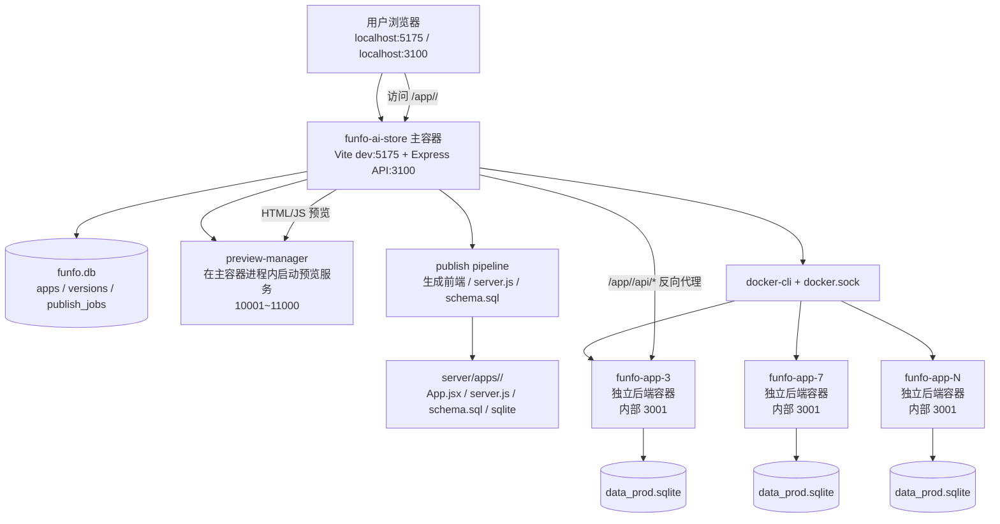
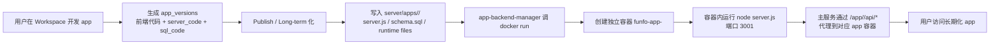
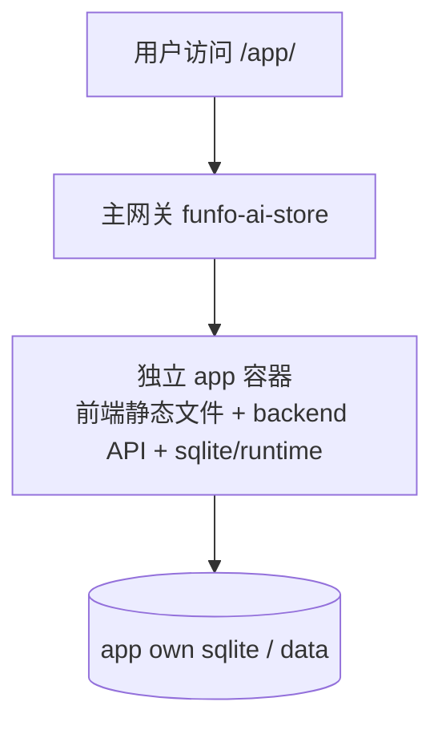

# funfo AI Store：当前 app 开发 → 长期化 架构图 & Docker 审计

生成时间：2026-03-15 04:50 JST

备份文件：`backups/funfo_AI_Store_pre_docker_audit_20260315-044914.tar.gz`

---

## 1) 当前整体架构图

---

## 2) 从“开发态”到“长期化”的链路图

---

## 3) 现在真正的 Docker 机制是什么

### 已确认事实
当前项目不是“完全没用 Docker”，而是：

- **主站容器**：`funfo-ai-store`
  - 跑 `5175`（Vite）
  - 跑 `3100`（主 Express 服务）
- **每个长期化 app 的后端容器**：`funfo-app-<appId>`
  - 例如：`funfo-app-3`、`funfo-app-7`、`funfo-app-12`、`funfo-app-14`
  - 容器内部固定监听 `3001`
  - 通过 Docker network 被主服务访问

### 已确认这些长期化 app 的容器是活着的
实测健康检查成功：

- `funfo-app-3` → `{"ok":true,"appId":3,"port":3001,"dbFile":"data_prod.sqlite","dbMode":"prod"}`
- `funfo-app-7` → `{"ok":true,"appId":7,"port":3001,"dbFile":"data_prod.sqlite","dbMode":"prod"}`
- `funfo-app-12` → 健康正常
- `funfo-app-14` → 健康正常

也就是说：

> **长期化 app 的后端，当前确实已经运行在 Docker 中。**

---

## 4) 为什么你会感觉“Docker 机制不正常”

因为现在是一个 **半 Docker 化架构**，体验上很容易误导：

### 问题 A：app 后端在 Docker，但 app 前端预览不在独立 Docker
当前：
- 前端预览由 `preview-manager` 在主服务进程里动态起本地预览端口（10001~11000）
- 不是每个 app 一个完整前后端容器

这会导致：
- 你看到的是主站容器 + 若干后端容器
- 但不是“一个长期化 app = 一个完整容器化应用”
- 所以从产品认知上，会觉得 Docker 机制不完整

### 问题 B：app 容器没有映射宿主机端口
每个 `funfo-app-*` 容器：
- **内部**监听 3001
- **没有** `-p 宿主机端口:3001`
- 只能被主服务通过 Docker network 访问

这会导致：
- `docker ps` 看起来像容器起来了，但你没法直接 `localhost:xxxx` 打开 app backend
- UI 里的 `api_port` 也长期是 `null`
- 很容易让人误以为 app 没成功启动

### 问题 C：系统里仍然保留了“旧 host-port 模型”的一些字段/概念
例如：
- DB 中还有 `api_port`
- preview-manager restore 时还会读 `a.api_port`
- 但 Docker 模式下 `getApiPort()` 永远返回 `null`

这会导致：
- 一部分代码/状态仍像“老架构”
- 一部分逻辑已经切换成“按 slug 代理到容器”
- 架构心智模型不统一

### 问题 D：长期化判断和 Docker 启动机制分散在多个条件里
例如长期化 app 现在更多表现为：
- `runtime_mode = 'server'`
- `status = 'private'` 或 `published`
- `app_role = 'release'`

而容器恢复又依赖：
- 最新版本存在 `server_code`

所以如果某个 app：
- 被标记成 server app
- 但没有有效 `server_code`

那它“看起来已经长期化了”，但实际上不会恢复出 app 容器。

---

## 5) 当前 Docker 机制的结论

### 结论 1：不是“没用 Docker”
而是：
- **主平台在 Docker**
- **长期化 app 的后端也在 Docker**
- **但长期化 app 的前端预览不在独立 Docker**

### 结论 2：当前最大问题不是“完全没跑 Docker”
而是：

> **长期化 app 只把后端容器化了，整体运行模型还没有完全 Docker 化。**

这会直接带来：
- 运行状态难理解
- 端口/健康状态不直观
- 前后端部署模型不统一
- 调试和排错成本高

### 结论 3：你怀疑“不是 Docker 部署导致很多问题”这个方向是对的，但要更准确地说：

> **不是“完全没 Docker”，而是“Docker 化不彻底，导致系统处于混合态”，这才是很多问题的根源。**

---

## 6) 我建议的目标架构（更稳定的长期化方案）

### 目标：一个长期化 app = 一个完整容器化运行单元

推荐方向：

1. **每个长期化 app 一个独立容器**
   - 容器内同时包含：
     - frontend build 产物
     - backend server
     - schema / sqlite runtime

2. **主服务只负责网关/编排**
   - 路由 `/app/<slug>` 到 app 容器
   - 路由 `/app/<slug>/api/*` 到同一容器内 API
   - 不再由主服务自己维护 preview-manager 的动态预览端口

3. **移除 `api_port` 这种旧模型字段依赖**
   - 改为“容器名 / slug / network route”模型

4. **明确区分两种模式**
   - 开发态：workspace preview（允许非 Docker）
   - 长期化：必须完整容器化

---

## 7) 这次审计里我确认到的关键代码位置

- Docker 主服务定义：`docker-compose.yml`
- 主服务镜像：`Dockerfile`
- 长期化 app 后端容器管理：`server/app-backend-manager.js`
- 前端预览服务：`server/preview-manager.js`
- `/app/<slug>` 到 app backend 的反向代理：`server/index.js`

---

## 8) 你现在最该做的改造顺序

### 第一优先级
**把“长期化 app = 完整容器化”定成唯一正确模型。**

### 第二优先级
把现在的混合机制拆清楚：
- 开发态 preview：可以保留现在的 preview-manager
- 长期化 release：改成完整 app container

### 第三优先级
补一个“运行状态可视化”
- 每个长期化 app 显示：
  - container name
  - running / stopped
  - health
  - latest image/build version
  - db mode

---

## 9) 简短结论

一句话总结：

> **现在长期化 app 的 backend 已经在 Docker 中运行，但整个长期化 app 还没有实现“完整 Docker 化”，而是卡在主服务 preview + app backend container 的混合架构里，这很可能正是当前不稳定和问题多的根源。**

