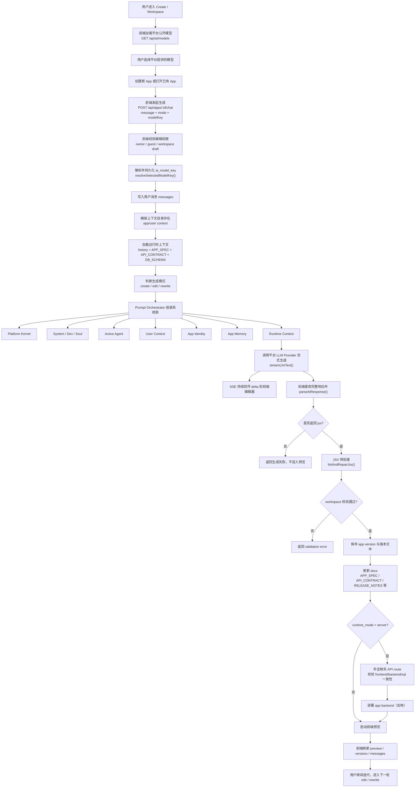
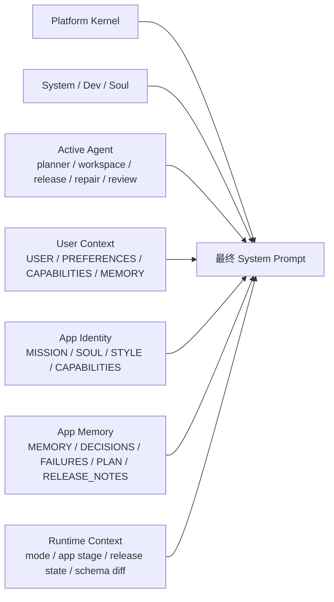

# Vibe Coding Generation Flow v2

## 主流程

## Prompt 编排层

## 关键结果

- 用户不再直接依赖 OpenClaw，而是走平台配置好的 provider + model。
- 生成不是“单 prompt”，而是带有 identity、agent、memory、runtime 的分层编排。
- 发布前的 release manifest 会沉淀为 `PLAN.md`，失败会沉淀为 `FAILURES.md`，让后续迭代和修复更连续。
