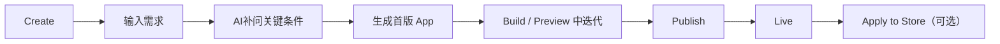

# funfo AI Store Vibe Coding 产品信息架构 v1

## 1. 目标

把当前偏“工程平台”的使用感，收敛成一个更清晰的 Vibe coding 产品：

- 用户第一眼知道这是“用自然语言做 app”
- 默认主路径只剩下：创建 -> 编辑 -> 预览 -> 发布 -> 上架
- 高级概念继续保留，但不默认压到新手脸上
- 商店与生成器明确分开，不再互相抢心智

---

## 2. 当前主要问题

### 2.1 顶层导航语义冲突

当前：

- `store` 实际是“模板 + prompt 生成页”
- `market` 才是真正的公开 App Store

用户看到“创建 App”和“App 商店”时，很难立刻理解两者差别。

### 2.2 默认暴露了太多发布内部状态

当前产品默认把这些状态暴露给用户：

- Draft
- Candidate
- Live
- Failed
- Rollback
- Linked Draft
- V10 发布流

这些概念对平台开发者有价值，但对创作者不是“首要心智”。

### 2.3 主路径不够短

当前用户需要同时理解：

- prompt 生成
- workspace 模式
- linked draft
- publish
- review
- app store 审核
- 基础设施

这会让“做出一个 app”这件事显得比实际复杂。

### 2.4 产品承诺与实际表达不一致

你已经在代码里铺了“AI 先分析需求、再补问、再生成”的产品方向，但主流程仍然更像直接 chat。

### 2.5 高级能力暴露过早

数据库、SQL 编辑器、analytics、runtime 这些都很强，但它们更适合：

- 发布后
- 高级用户
- 运营/维护场景

而不是默认主舞台。

---

## 3. 新的产品定位

一句话定位建议：

> funfo 是一个用自然语言快速生成、迭代并发布业务 app 的 AI 工作台。

对外只讲 3 件事：

- 描述需求
- AI 生成可用 app
- 一键发布并持续迭代

对内再保留 runtime、candidate、rollback、review 等机制。

---

## 4. 目标 IA

## 顶层导航

建议改成 4 个一级入口：

1. `Create`
2. `Projects`
3. `App Store`
4. `Account`

不再把 `Workspace` 当一级导航卖给新用户，因为它其实是项目内工作态，不是一个独立心智入口。

## 项目内导航

进入某个 app 后，再出现二级导航：

1. `Build`
2. `Preview`
3. `Publish`
4. `Advanced`

说明：

- `Build`：聊天生成、编辑、设计模式、版本上下文
- `Preview`：设备预览、错误、运行状态
- `Publish`：发布准备、发布进度、分享、上架申请
- `Advanced`：数据库、运行时、analytics、文件、基础设施

---

## 5. 路由与页面职责

### 5.1 `Create`

替代现在的 `store`。

职责：

- 输入一句需求
- 选择模板或示例
- AI 补问 2-4 个关键问题
- 开始生成

这里不放“真实公开 App 市场”内容。

### 5.2 `Projects`

替代现在“Workspace + My Apps”的分裂体验。

职责：

- 展示我做过的项目
- 区分草稿中、已发布、待上架
- 进入某个项目继续编辑

这里应是创作者回访的主入口。

### 5.3 `App Store`

只放真正公开可用的应用。

职责：

- 浏览已审核公开的 app
- 直接试用 live app
- 收藏
- 基于某个 app 创建自己的版本

这里不要混入“模板推荐”的假数据心智。

### 5.4 `Account`

职责：

- 个人资料
- 登录状态
- 用量 / 配额
- 偏好设置

---

## 6. 目标用户主路径



### 6.1 新用户首次成功路径

只保留这 5 步：

1. 输入需求
2. AI 确认关键要求
3. 生成首版
4. 预览并修改
5. 发布

### 6.2 老用户回访路径

1. 打开 `Projects`
2. 选择某个项目
3. 进入 `Build`
4. 修改后再次 `Publish`

### 6.3 消费者路径

1. 打开 `App Store`
2. 浏览公开应用
3. 直接使用 live app
4. 喜欢的话收藏或复制为自己的项目

---

## 7. 命名重构建议

### 顶层命名

- `store` -> `Create`
- `market` -> `App Store`
- `workspace` -> 从一级导航中移除，改为项目内的 `Build`
- `myapps` -> `Projects`
- `profile` -> `Account`

### 状态命名

对普通用户显示：

- `Draft` -> `In Progress`
- `Candidate` -> `Publishing`
- `Live` -> `Live`
- `Failed` -> `Publish Failed`
- `Rollback` -> `Recovered`

对高级用户或 debug 面板中，才显示真实内部状态名。

### 动作命名

- `提审` -> `Apply to Store`
- `基础设施` -> `Advanced`
- `保存属性并进入 Candidate 发布` -> `Publish Now`
- `自分用に編集` -> `Create My Version`

---

## 8. 重要的产品分层

### 默认层

所有用户都应该先看到：

- 需求输入
- AI 生成
- 预览
- 发布
- 公开分享

### 高级层

折叠到 `Advanced`：

- 数据库浏览
- SQL 编辑器
- analytics
- runtime / backend 状态
- 文件树
- linked draft / release 关系

### 平台运营层

只给 admin：

- review 审核
- candidate -> live
- failed 清理
- rollback promote

---

## 9. 对现有代码的映射建议

### Phase 1：先改信息架构，不动底层状态机

目标：

- 保持后端 `draft/candidate/live/failed/rollback` 不变
- 只重做前端命名、导航和页面分层

建议动作：

1. 顶部导航改为 `Create / Projects / App Store / Account`
2. 把当前 `workspace` 的一级入口弱化
3. 把 `My Apps` 升级成 `Projects`
4. 把 `基础设施` 收进二级 `Advanced`

### Phase 2：把生成前澄清流程接通

目标：

- 真正启用 `planning / questionnaire / pendingGeneration`
- 让首轮生成变成结构化流程，而不是直接裸 chat

建议动作：

1. `Create` 页提交后先进入 AI 分析态
2. 返回 2-4 个关键问题
3. 用户补充后再真正调用生成
4. 如果用户跳过，就走“直接生成”

### Phase 3：发布体验产品化

目标：

- 保留内部状态机
- 简化用户看到的发布表达

建议动作：

1. `Publish` 页默认只显示三态：Ready / Publishing / Live
2. 失败时展开原因和修复建议
3. `Apply to Store` 作为可选后续动作，不跟发布混在一起

### Phase 4：商店可信度建设

目标：

- 让 `App Store` 像真实市场，不像演示数据

建议动作：

1. `Create` 页保留模板
2. `App Store` 页只展示真实公开 app
3. 评分、使用量、发布者改成真实后端数据
4. 类目改成结构化字段，不靠描述文案匹配

---

## 10. 推荐的页面结构

```txt
Top Nav
├─ Create
│  ├─ Prompt Input
│  ├─ Template Picks
│  ├─ AI Clarification
│  └─ Generate
├─ Projects
│  ├─ In Progress
│  ├─ Live
│  ├─ Store Applied
│  └─ Open Project
├─ App Store
│  ├─ Browse Live Apps
│  ├─ Use
│  ├─ Favorite
│  └─ Create My Version
└─ Account

Project View
├─ Build
├─ Preview
├─ Publish
└─ Advanced
```

---

## 11. 最小可执行改版顺序

如果只做一轮低风险重构，我建议顺序是：

1. 改导航与命名
2. 合并 `Workspace` 与 `My Apps` 的心智
3. 把 `基础设施` 下沉到 `Advanced`
4. 把 `提审` 从发布成功主流程中拆开
5. 接通 AI 澄清流程

---

## 12. 最终判断

funfo AI Store 现在最缺的，不是再加更多能力，而是：

- 收口产品语言
- 缩短默认成功路径
- 隐藏内部工程复杂度
- 让“做出 app”成为唯一主叙事

当这 4 件事完成后，它会更像一个成熟的 Vibe coding 产品，而不只是一个很强的 app 生成平台。
